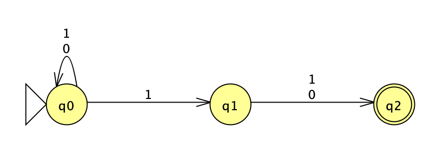
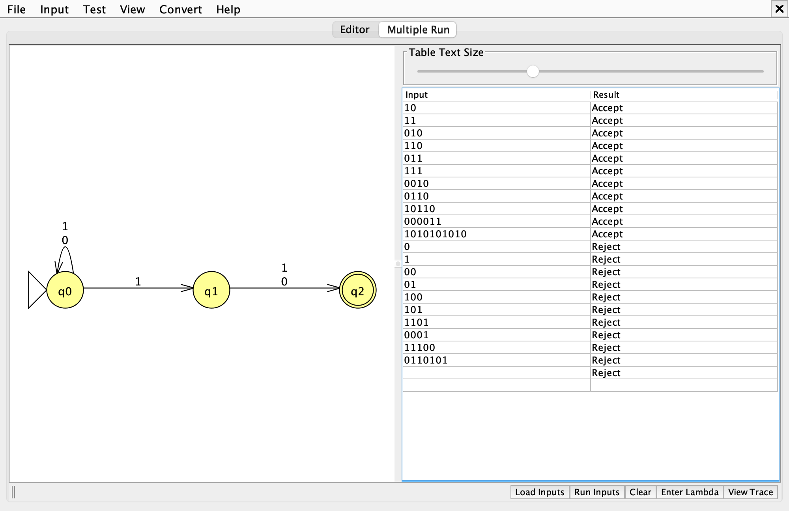
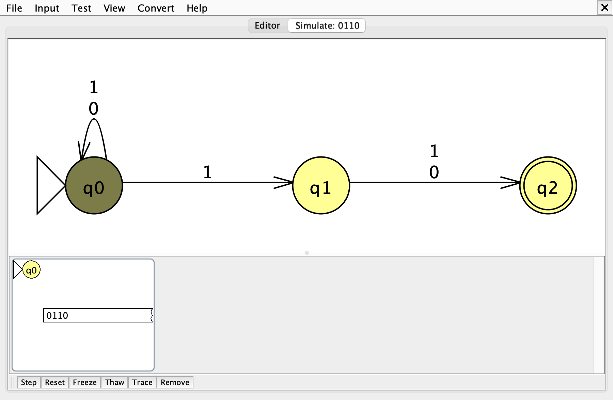
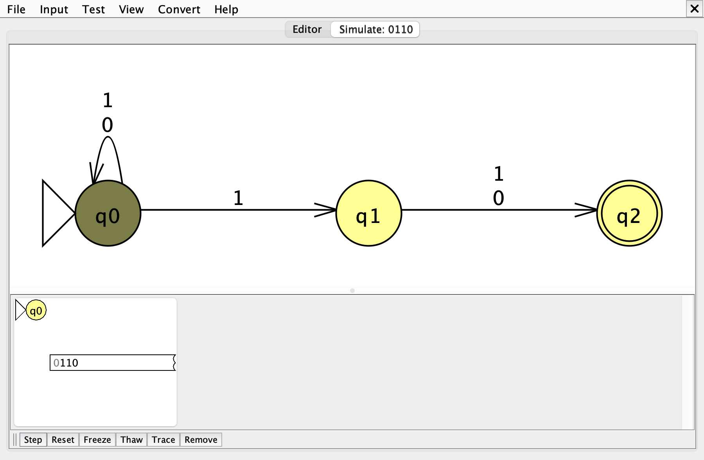
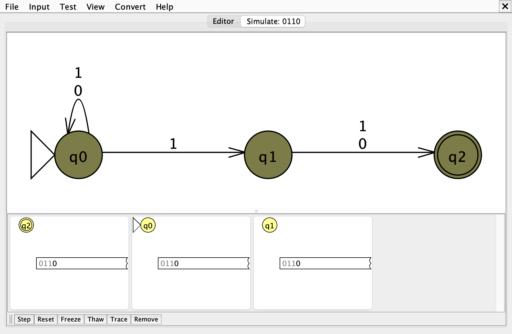
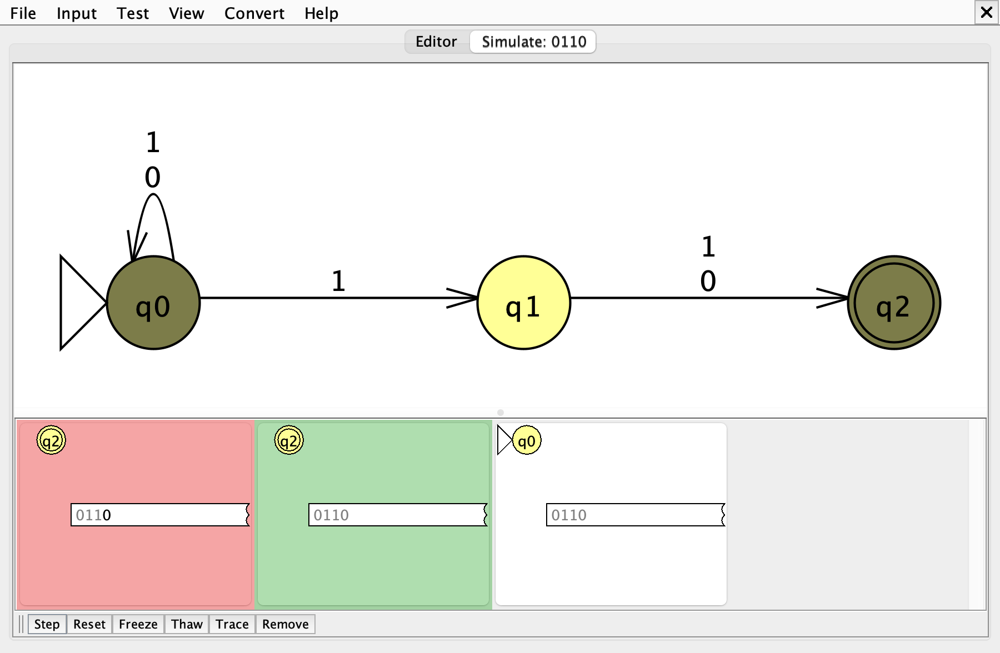

# Problem 6: 2nd to last bit is 1

Σ = {0, 1}, L = { s | the 2nd to last bit of s is 1 }

Files: [n06.jff](n06.jff), [n06t.txt](n06t.txt)

## 1. NFA

The machine cannot know which 1 is the 2nd to last bit until the input ends, so it guesses. `q0` loops on everything; on any 1 it may also jump to `q1`, betting that exactly one more symbol follows. `q2` has no outgoing transitions, so a bet made too early dies.

| State | Meaning |
|---|---|
| `q0` | still scanning; no guess made yet |
| `q1` | guessed that the 1 just read is the 2nd to last bit |
| `q2` | read one more symbol after the guess; accepts only if the input ends here |

## 2. Batch run

Expected results, accepted strings first:

| # | String | Expected |
|---|---|---|
| 1 | `10` | Accept |
| 2 | `11` | Accept |
| 3 | `010` | Accept |
| 4 | `110` | Accept |
| 5 | `011` | Accept |
| 6 | `111` | Accept |
| 7 | `0010` | Accept |
| 8 | `0110` | Accept |
| 9 | `10110` | Accept |
| 10 | `000011` | Accept |
| 11 | `1010101010` | Accept |
| 12 | `0` | Reject |
| 13 | `1` | Reject |
| 14 | `00` | Reject |
| 15 | `01` | Reject |
| 16 | `100` | Reject |
| 17 | `101` | Reject |
| 18 | `1101` | Reject |
| 19 | `0001` | Reject |
| 20 | `11100` | Reject |
| 21 | `0110101` | Reject |

The empty string λ is also a test case (expected: **Reject**). JFLAP's *Load Inputs* reads whitespace-separated strings, so λ cannot be stored in `n06t.txt`; it is added in the Multiple Run table with the *Enter Lambda* button.

## 3. Gold-st-ring: `0110`

`0110` is worth tracing because every 1 forks a new guess, and the two early guesses have to die for the right reason. Expected result: **Accept**.

<!-- TODO: say in your own words what surprised you about this string -->

Hand-drawn computation tree:

Active states after each symbol (Input > Step with Closure):

| Step | Read | Remaining | Active states |
|---|---|---|---|
| 0 | (start) | `0110` | {q0} |
| 1 | `0` | `110` | {q0} |
| 2 | `1` | `10` | {q0, q1} |
| 3 | `1` | `0` | {q0, q1, q2} |
| 4 | `0` | λ | {q0, q2} |

