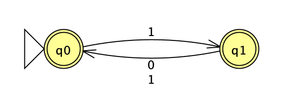
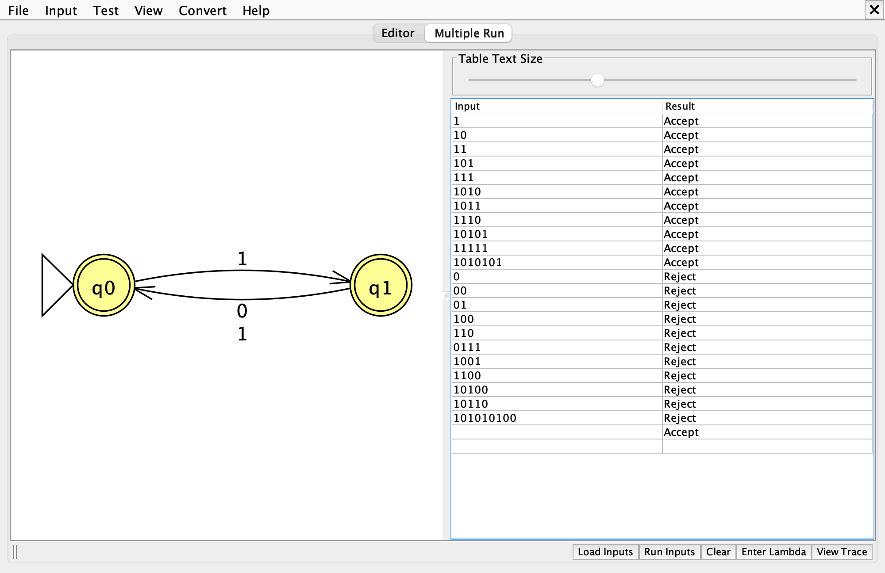
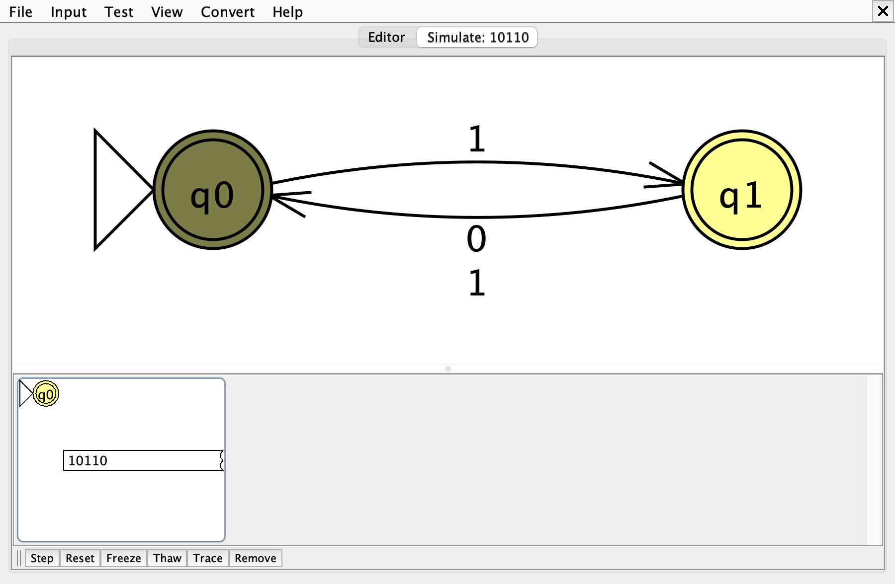
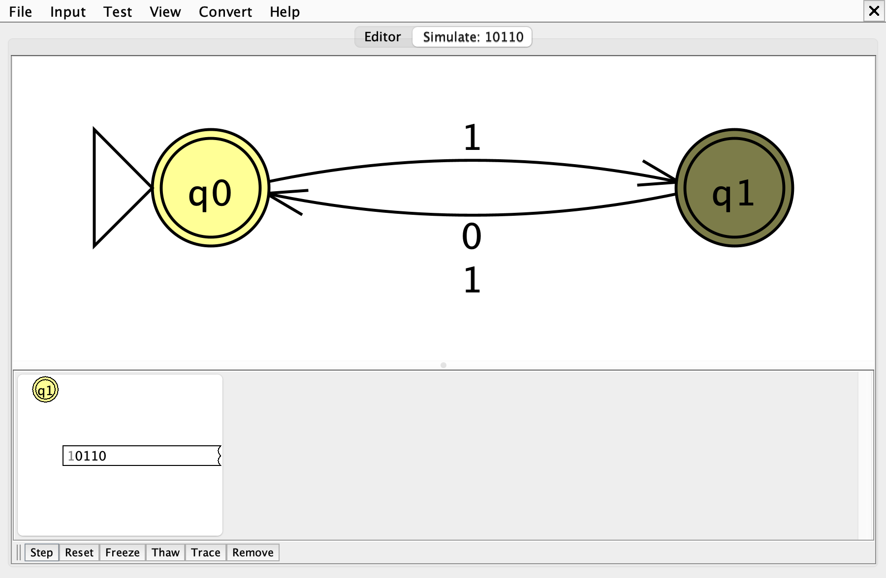
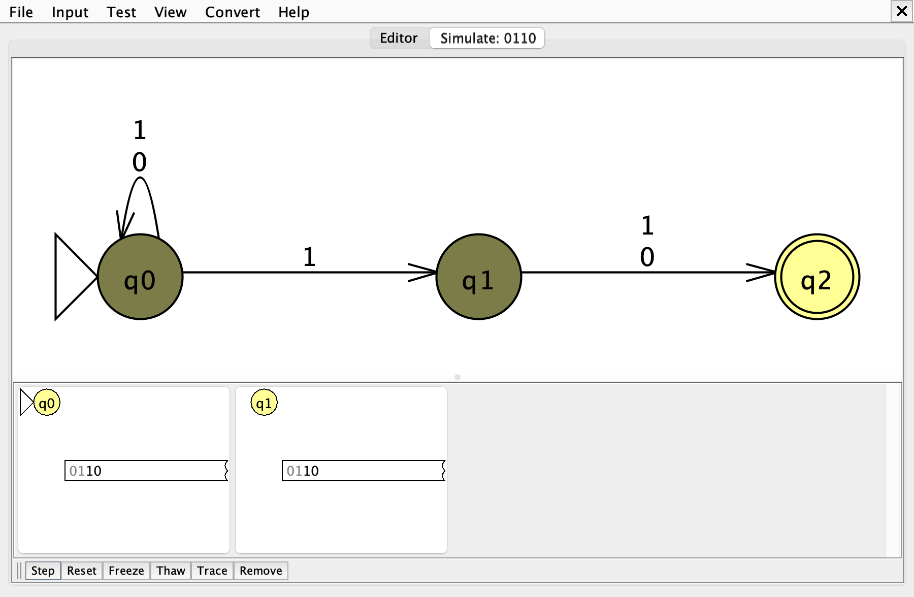
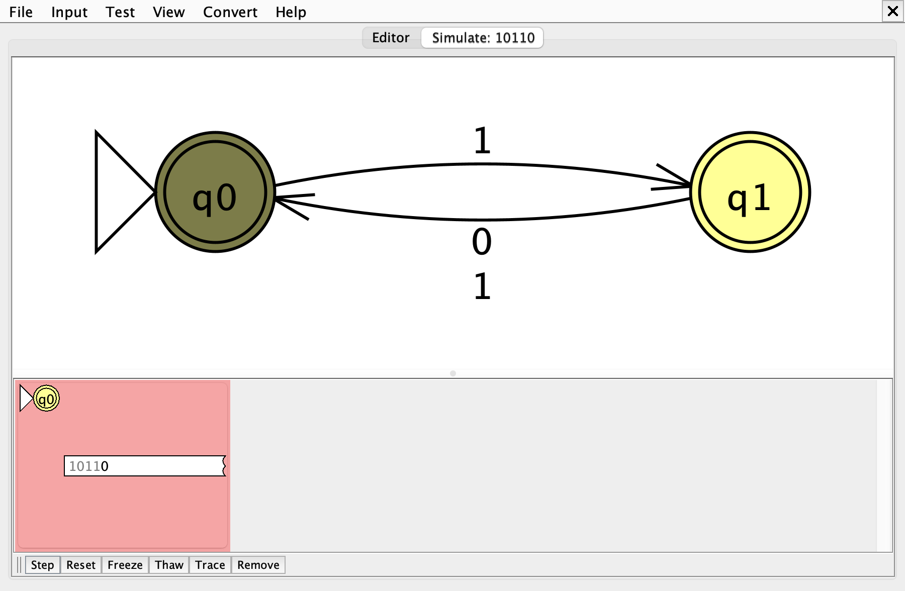

# Problem 11: every odd position is 1

Σ = {0, 1}, L = { s | every odd position of s is 1 } (positions start at 1)

Files: [n11.jff](n11.jff), [n11t.txt](n11t.txt)

## 1. NFA

Only the parity of the current position matters. From `q0` the next symbol sits at an odd position, so only 1 is allowed; there is no transition on 0, so that branch simply dies and no trap state is needed. Both states are final, and λ is accepted because it has no odd position that could break the rule.

| State | Meaning |
|---|---|
| `q0` | even number of symbols read; the next symbol is at an odd position and must be 1 |
| `q1` | odd number of symbols read; the next symbol is at an even position and can be anything |

## 2. Batch run

Expected results, accepted strings first:

| # | String | Expected |
|---|---|---|
| 1 | `1` | Accept |
| 2 | `10` | Accept |
| 3 | `11` | Accept |
| 4 | `101` | Accept |
| 5 | `111` | Accept |
| 6 | `1010` | Accept |
| 7 | `1011` | Accept |
| 8 | `1110` | Accept |
| 9 | `10101` | Accept |
| 10 | `11111` | Accept |
| 11 | `1010101` | Accept |
| 12 | `0` | Reject |
| 13 | `00` | Reject |
| 14 | `01` | Reject |
| 15 | `100` | Reject |
| 16 | `110` | Reject |
| 17 | `0111` | Reject |
| 18 | `1001` | Reject |
| 19 | `1100` | Reject |
| 20 | `10100` | Reject |
| 21 | `10110` | Reject |
| 22 | `101010100` | Reject |

The empty string λ is also a test case (expected: **Accept**). JFLAP's *Load Inputs* reads whitespace-separated strings, so λ cannot be stored in `n11t.txt`; it is added in the Multiple Run table with the *Enter Lambda* button.

## 3. Gold-st-ring: `10110`

`10110` is worth tracing because it is rejected with no active state left at all, instead of ending in a non-final state. Expected result: **Reject**.

<!-- TODO: say in your own words what surprised you about this string -->

Hand-drawn computation tree:

Active states after each symbol (Input > Step with Closure):

| Step | Read | Remaining | Active states |
|---|---|---|---|
| 0 | (start) | `10110` | {q0} |
| 1 | `1` | `0110` | {q1} |
| 2 | `0` | `110` | {q0} |
| 3 | `1` | `10` | {q1} |
| 4 | `1` | `0` | {q0} |
| 5 | `0` | λ | ∅ (every branch has died) |

