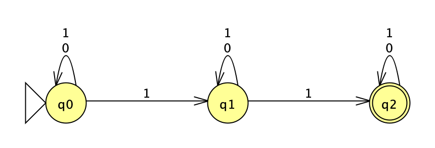
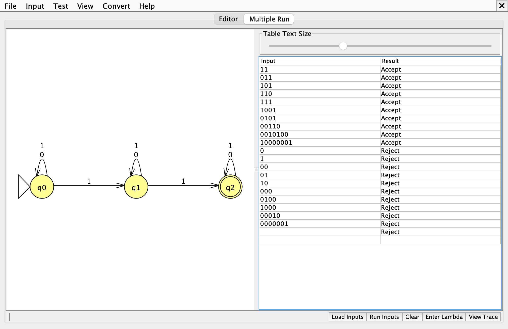

# Problem 13: at least two 1's

Σ = {0, 1}, L = { s | s contains at least 2 1's }

Files: [n13.jff](n13.jff), [n13t.txt](n13t.txt)

## 1. NFA

Pattern Σ\*1Σ\*1Σ\*. Each state loops on both symbols, and a 1 may also be claimed as one of the two required 1's, which moves the machine one state to the right.

| State | Meaning |
|---|---|
| `q0` | no 1 claimed yet |
| `q1` | one 1 claimed |
| `q2` | two 1's claimed; absorbs the rest of the input |

## 2. Batch run

Expected results, accepted strings first:

| # | String | Expected |
|---|---|---|
| 1 | `11` | Accept |
| 2 | `011` | Accept |
| 3 | `101` | Accept |
| 4 | `110` | Accept |
| 5 | `111` | Accept |
| 6 | `1001` | Accept |
| 7 | `0101` | Accept |
| 8 | `00110` | Accept |
| 9 | `0010100` | Accept |
| 10 | `10000001` | Accept |
| 11 | `0` | Reject |
| 12 | `1` | Reject |
| 13 | `00` | Reject |
| 14 | `01` | Reject |
| 15 | `10` | Reject |
| 16 | `000` | Reject |
| 17 | `0100` | Reject |
| 18 | `1000` | Reject |
| 19 | `00010` | Reject |
| 20 | `0000001` | Reject |
| 21 | λ | Reject |

The last row is the empty string λ, which JFLAP shows as a blank Input cell. *Load Inputs* reads whitespace-separated strings, so λ cannot be stored in `n13t.txt`; it is added to the table with the *Enter Lambda* button.
