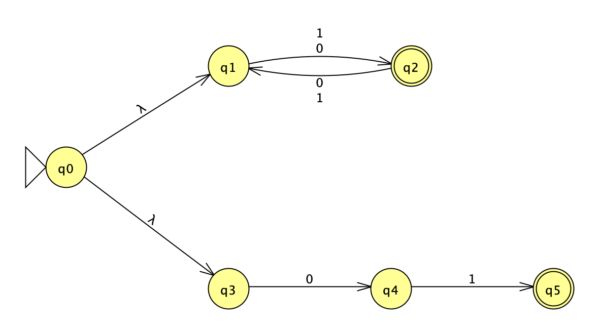
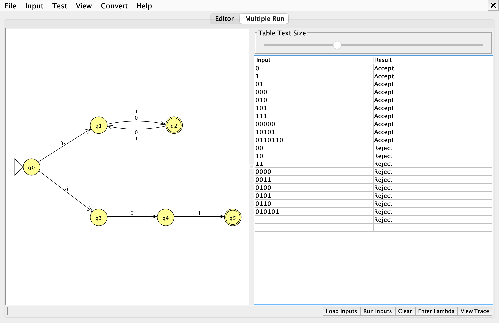

# Problem 18: odd length or s = 01

Σ = {0, 1}, L = { s | s has odd length or s = 01 }

Files: [n18.jff](n18.jff), [n18t.txt](n18t.txt)

## 1. NFA

Union by λ-transitions. The top pair flips on every symbol to track length parity. The bottom chain spells out exactly `01` and has no other transitions, so any other string kills that branch.

| State | Meaning |
|---|---|
| `q0` | start; λ-moves into both branches |
| `q1` | even length so far |
| `q2` | odd length so far (final) |
| `q3` | chain: nothing read |
| `q4` | chain: read `0` |
| `q5` | chain: read exactly `01` (final) |

## 2. Batch run

Expected results, accepted strings first:

| # | String | Expected |
|---|---|---|
| 1 | `0` | Accept |
| 2 | `1` | Accept |
| 3 | `01` | Accept |
| 4 | `000` | Accept |
| 5 | `010` | Accept |
| 6 | `101` | Accept |
| 7 | `111` | Accept |
| 8 | `00000` | Accept |
| 9 | `10101` | Accept |
| 10 | `0110110` | Accept |
| 11 | `00` | Reject |
| 12 | `10` | Reject |
| 13 | `11` | Reject |
| 14 | `0000` | Reject |
| 15 | `0011` | Reject |
| 16 | `0100` | Reject |
| 17 | `0101` | Reject |
| 18 | `0110` | Reject |
| 19 | `010101` | Reject |
| 20 | λ | Reject |

The last row is the empty string λ, which JFLAP shows as a blank Input cell. *Load Inputs* reads whitespace-separated strings, so λ cannot be stored in `n18t.txt`; it is added to the table with the *Enter Lambda* button.
