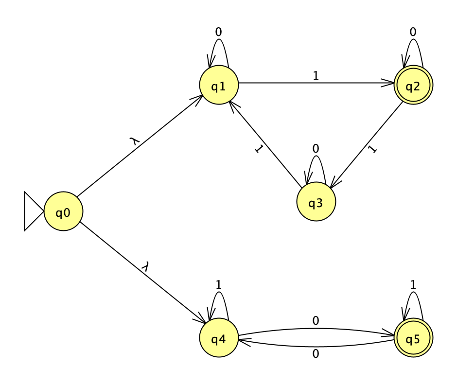
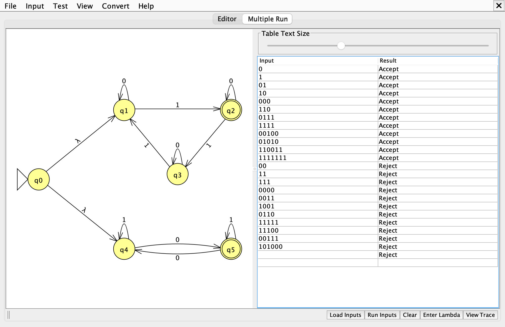

# Problem 20: 3k+1 1's (k ≥ 0) or an odd number of 0's

Σ = {0, 1}, L = { s | s has 3k+1 1's, where k ≥ 0, or an odd number of 0's }

Files: [n20.jff](n20.jff), [n20t.txt](n20t.txt)

## 1. NFA

Union of two small counters joined by λ-transitions from a new start state. The top triangle counts 1's mod 3 and ignores 0's; the bottom pair tracks the parity of 0's and ignores 1's. The string is accepted if either counter ends in its final state.

| State | Meaning |
|---|---|
| `q0` | start; λ-moves into both counters |
| `q1` | number of 1's mod 3 = 0 |
| `q2` | number of 1's mod 3 = 1 (final) |
| `q3` | number of 1's mod 3 = 2 |
| `q4` | even number of 0's |
| `q5` | odd number of 0's (final) |

## 2. Batch run

Expected results, accepted strings first:

| # | String | Expected |
|---|---|---|
| 1 | `0` | Accept |
| 2 | `1` | Accept |
| 3 | `01` | Accept |
| 4 | `10` | Accept |
| 5 | `000` | Accept |
| 6 | `110` | Accept |
| 7 | `0111` | Accept |
| 8 | `1111` | Accept |
| 9 | `00100` | Accept |
| 10 | `01010` | Accept |
| 11 | `110011` | Accept |
| 12 | `1111111` | Accept |
| 13 | `00` | Reject |
| 14 | `11` | Reject |
| 15 | `111` | Reject |
| 16 | `0000` | Reject |
| 17 | `0011` | Reject |
| 18 | `1001` | Reject |
| 19 | `0110` | Reject |
| 20 | `11111` | Reject |
| 21 | `11100` | Reject |
| 22 | `00111` | Reject |
| 23 | `101000` | Reject |
| 24 | λ | Reject |

The last row is the empty string λ, which JFLAP shows as a blank Input cell. *Load Inputs* reads whitespace-separated strings, so λ cannot be stored in `n20t.txt`; it is added to the table with the *Enter Lambda* button.
