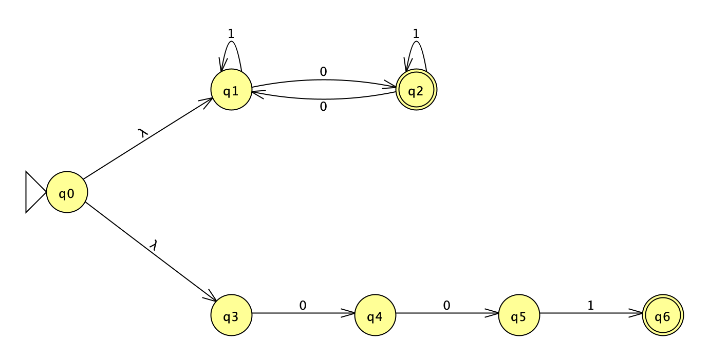
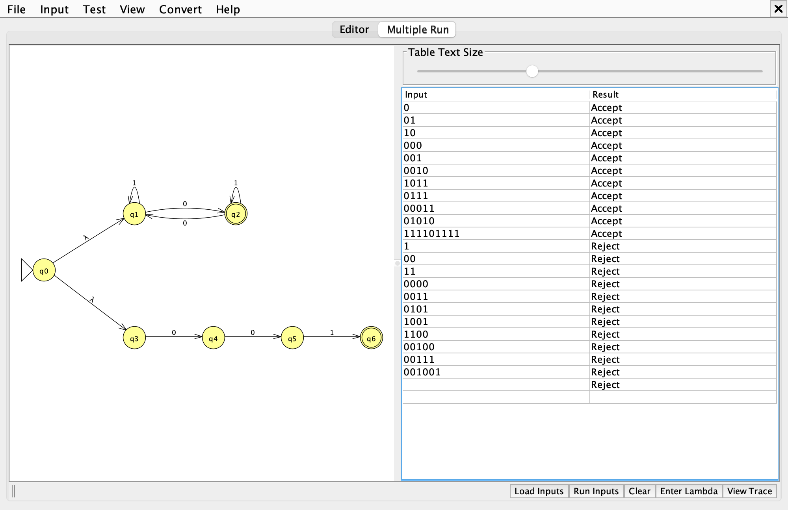
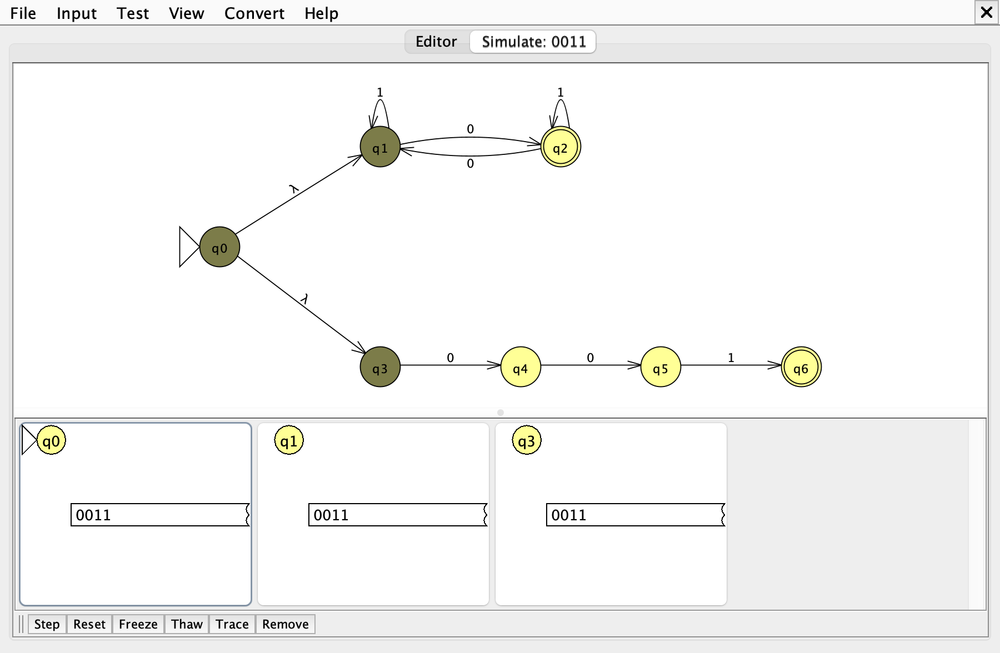
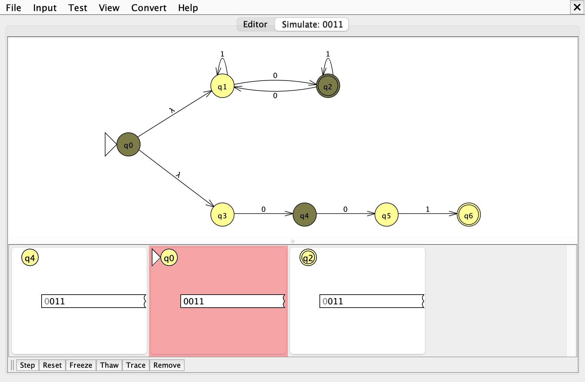
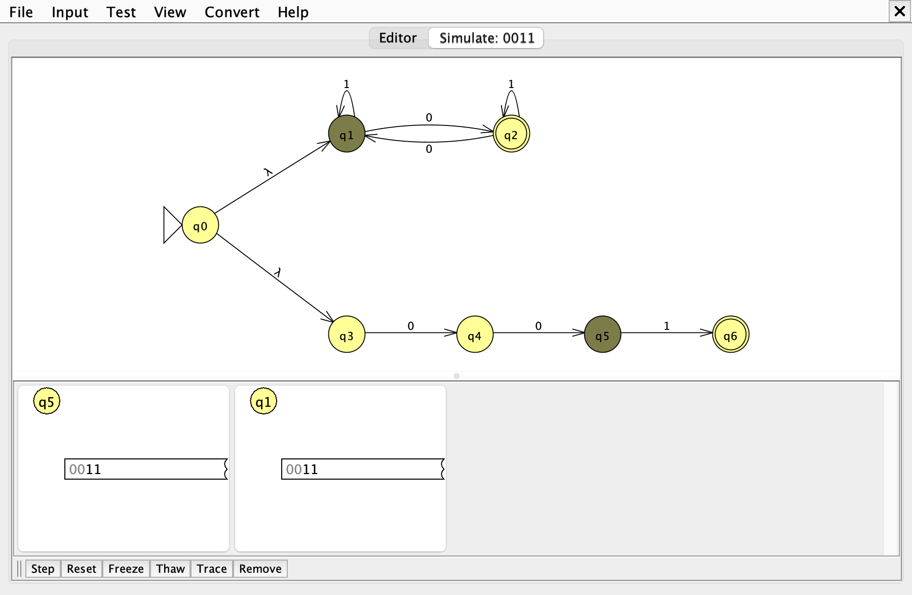
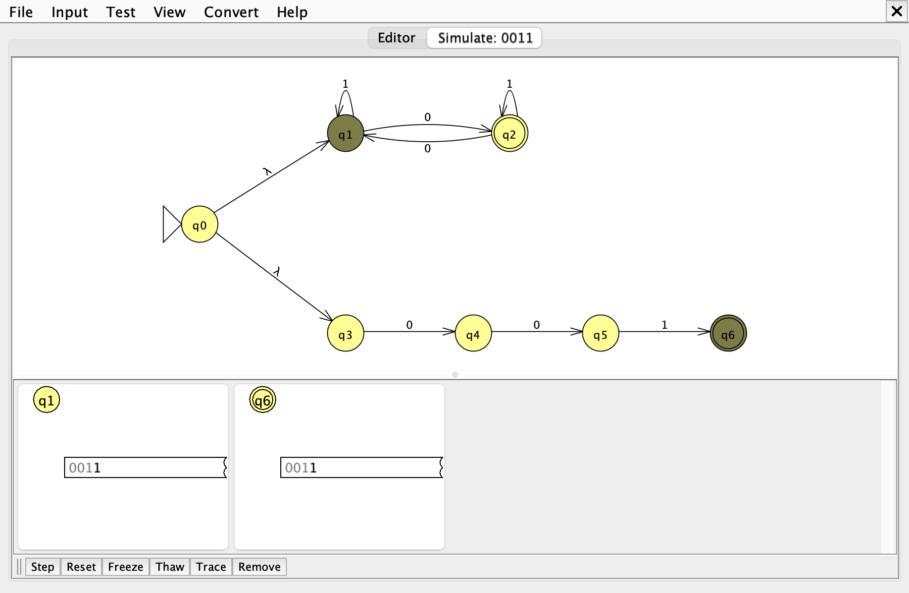
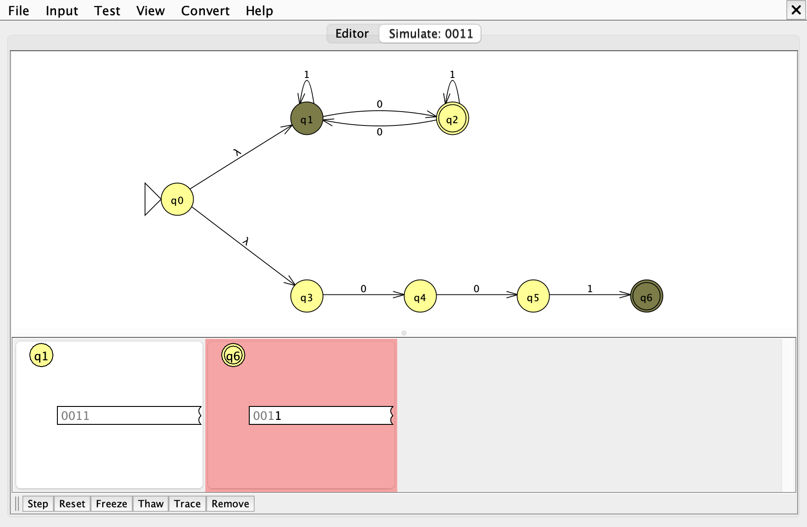
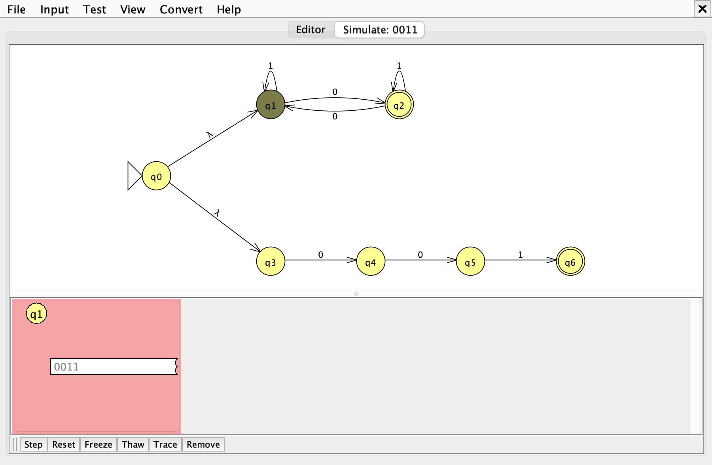

# Problem 24: odd number of 0's or s = 001

Σ = {0, 1}, L = { s | s has an odd number of 0's or s = 001 }

Files: [n24.jff](n24.jff), [n24t.txt](n24t.txt)

## 1. NFA



Union by λ-transitions. The top pair tracks the parity of 0's and ignores 1's. The bottom chain spells out exactly `001`; it is needed because 001 has two 0's and the parity branch rejects it.

| State | Meaning |
|---|---|
| `q0` | start; λ-moves into both branches |
| `q1` | even number of 0's |
| `q2` | odd number of 0's (final) |
| `q3` | chain: nothing read |
| `q4` | chain: read `0` |
| `q5` | chain: read `00` |
| `q6` | chain: read exactly `001` (final) |

## 2. Batch run



Expected results, accepted strings first:

| # | String | Expected |
|---|---|---|
| 1 | `0` | Accept |
| 2 | `01` | Accept |
| 3 | `10` | Accept |
| 4 | `000` | Accept |
| 5 | `001` | Accept |
| 6 | `0010` | Accept |
| 7 | `1011` | Accept |
| 8 | `0111` | Accept |
| 9 | `00011` | Accept |
| 10 | `01010` | Accept |
| 11 | `111101111` | Accept |
| 12 | `1` | Reject |
| 13 | `00` | Reject |
| 14 | `11` | Reject |
| 15 | `0000` | Reject |
| 16 | `0011` | Reject |
| 17 | `0101` | Reject |
| 18 | `1001` | Reject |
| 19 | `1100` | Reject |
| 20 | `00100` | Reject |
| 21 | `00111` | Reject |
| 22 | `001001` | Reject |
| 23 | λ | Reject |

The last row is the empty string λ, which JFLAP shows as a blank Input cell. *Load Inputs* reads whitespace-separated strings, so λ cannot be stored in `n24t.txt`; it is added to the table with the *Enter Lambda* button.

## 3. Gold-st-ring: `0011`

`0011` is worth tracing because the chain reaches its final state after `001`, then the extra 1 kills it, and the parity branch is in the wrong state. Expected result: **Reject**.

Computation tree:

```text
q0
├─λ→ q1
│    └─0→ q2
│         └─0→ q1
│              └─1→ q1
│                   └─1→ q1   end of input, not final
└─λ→ q3
     └─0→ q4
          └─0→ q5
               └─1→ q6
                    ✗ no move on 1: branch dies
```

Active states after each symbol (Input > Step with Closure):

| Step | Read | Remaining | Active states |
|---|---|---|---|
| 0 | (start) | `0011` | {q0, q1, q3} |
| 1 | `0` | `011` | {q2, q4} |
| 2 | `0` | `11` | {q1, q5} |
| 3 | `1` | `1` | {q1, q6} |
| 4 | `1` | λ | {q1} |

The same steps in JFLAP. A red box is a configuration that is stuck with input left or has been rejected; a green box is one that accepts.

**Step 0** (start)



**Step 1** (after reading `0`)



**Step 2** (after reading `00`)



**Step 3** (after reading `001`)



**Step 4** (after reading `0011`)



**Step 5.** One more Step with no input left: `q1` is not final, so JFLAP rejects the last configuration.


